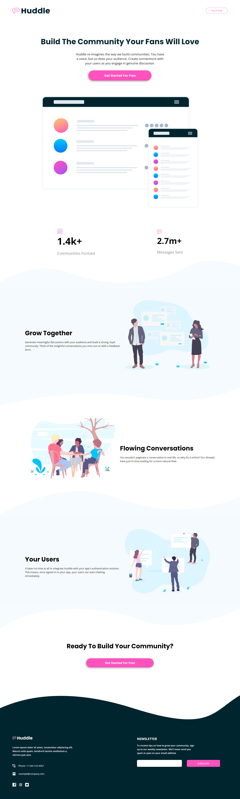

# Frontend Mentor - Huddle landing page with curved sections solution

This is a solution to the [Huddle landing page with curved sections challenge on Frontend Mentor](https://www.frontendmentor.io/challenges/huddle-landing-page-with-curved-sections-5ca5ecd01e82137ec91a50f2). Frontend Mentor challenges help you improve your coding skills by building realistic projects. 

## Table of contents

- [Overview](#overview)
  - [The challenge](#the-challenge)
  - [Screenshot](#screenshot)
  - [Links](#links)
- [My process](#my-process)
  - [Built with](#built-with)
  - [What I learned](#what-i-learned)
- [Author](#author)

**Note: Delete this note and update the table of contents based on what sections you keep.**

## Overview

### The challenge

Users should be able to:

- View the optimal layout for the site depending on their device's screen size
- See hover states for all interactive elements on the page

### Screenshot
#### Mobile

#### Desktop

### Links

- Solution URL: [Frontend mentor solution](https://www.frontendmentor.io/solutions/huddle-landing-page-with-curved-sections-using-css-html-js-B1naiQSV5)
- Live Site URL: [Live](https://donmatano.github.io/huddle-landing-page-with-curved-sections/)

## My process

### Built with

- Semantic HTML5 markup
- CSS custom properties
- Flexbox
- Javascript

### What I learned

- How to HTML, CSS and Javascript.
- Working with curved designs.

## Author

- Frontend Mentor - [@DonMatano](https://www.frontendmentor.io/profile/DonMatano)
- Twitter - [@MMatano5](https://www.twitter.com/MMatano5)

